## 为什么选择容器化部署 EJBCA

容器化，方便、快捷，不再赘述

## 部署流程

- 镜像版本：`primekey/ejbca-ce:7.11.0`

### 获取资源文件

```bash
# 创建容器
docker create --name ejbca primekey/ejbca-ce:7.11.0

# 拷贝opt/keyfactor到本地
docker cp ejbca:/opt/keyfactor .

# 移除容器
docker rm -f ejbca

# 修改httpserver.external.privhttps=8443为本地映射端口，否则管理界面链接打开端口默认为443
# keyfactor/ejbca/conf/web.properties >> httpserver.external.privhttps
```

### 启动容器

```yml
image: primekey/ejbca-ce:7.11.0
    container_name: ejbca8
    volumes:
      - ./ejbca/keyfactor:/opt/keyfactor
    ports:
      - 9080:8080
      - 8443:8443
```
## 基础使用
### 创建CA
1.进入管理界面
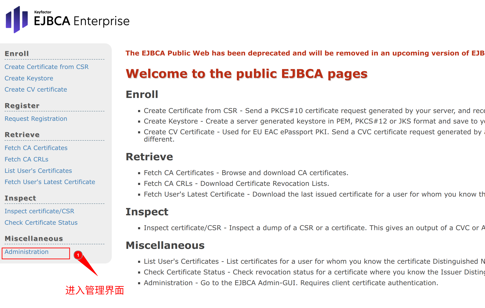
2.创建ca  
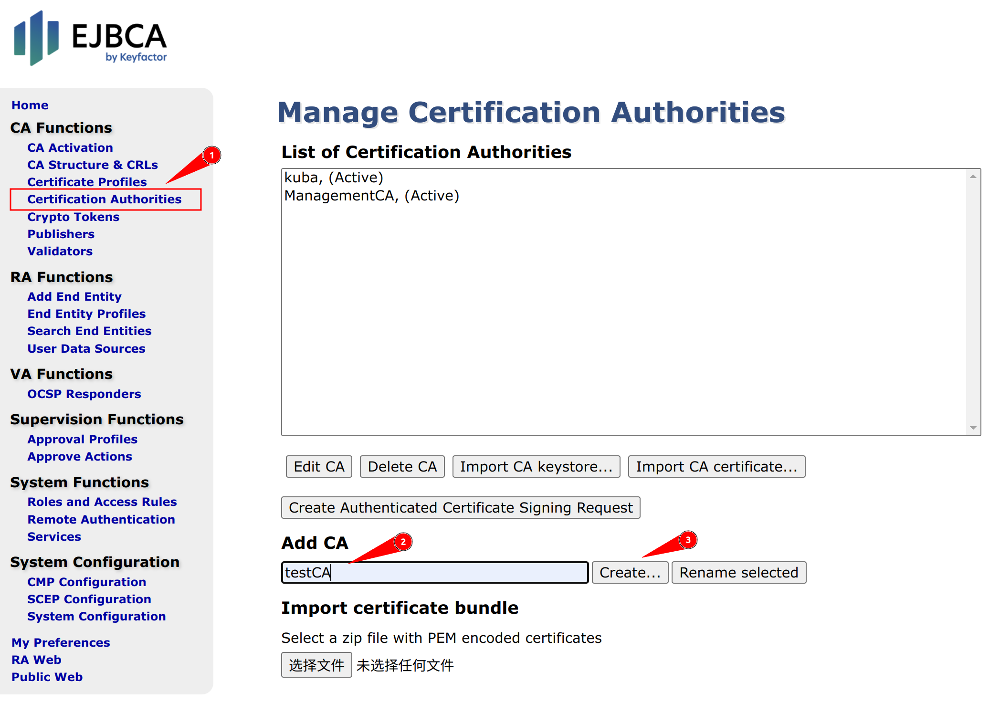
- 有效期，可以写365d 

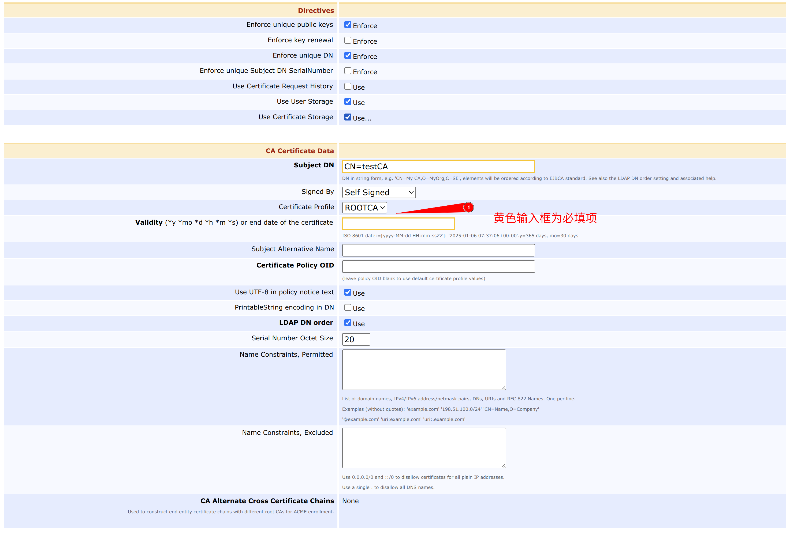
### 创建证书配置文件
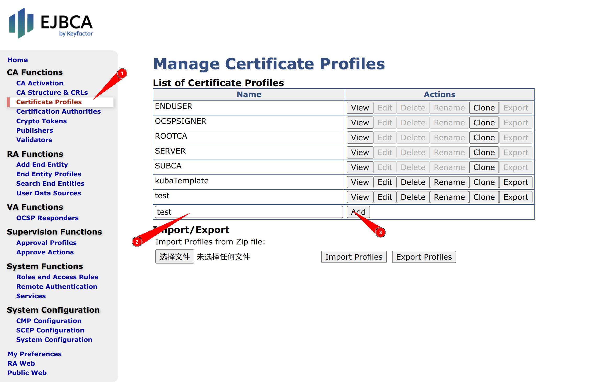
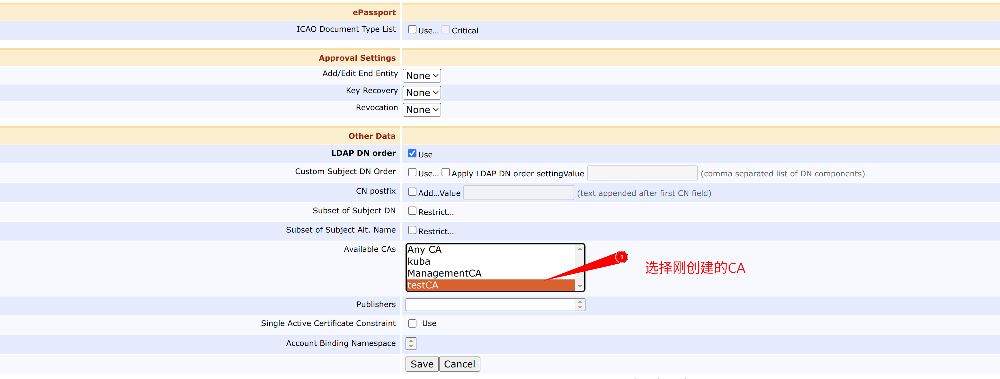
### 创建实体配置文件
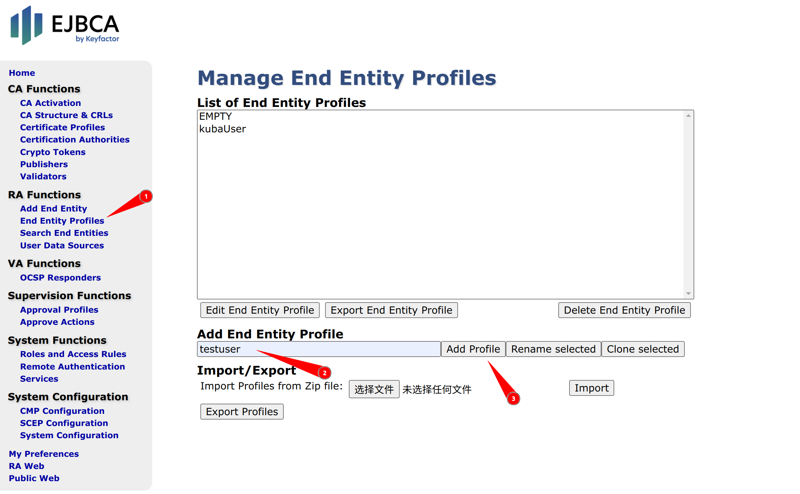

### 添加实体
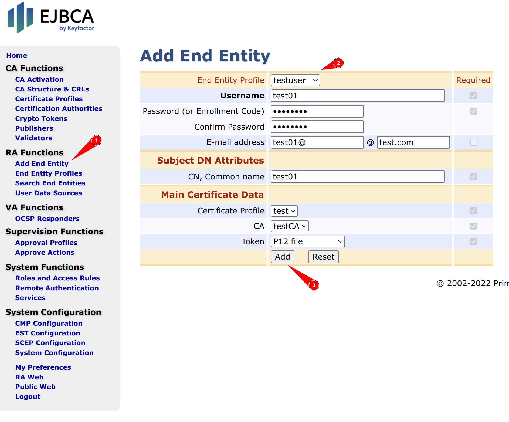
### 下载ca证书
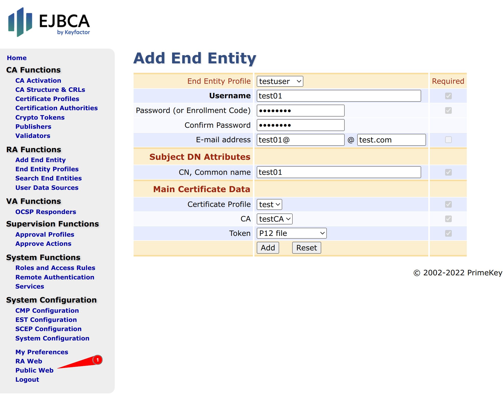
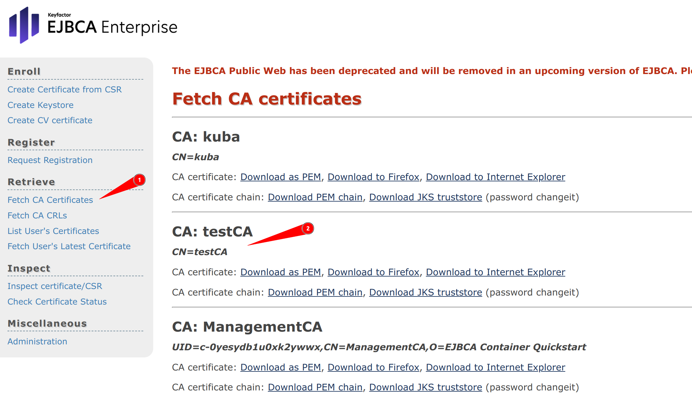
### 下载用户证书
1. 检查用户状态是否为new
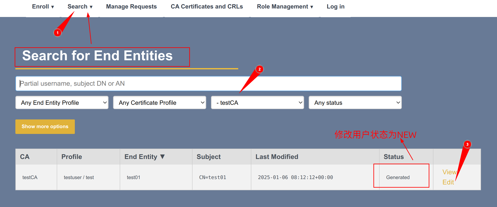
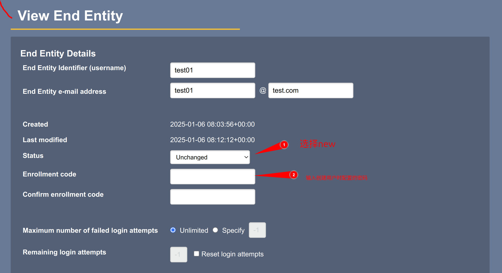
2. 搜索用户，下载指定类型的证书
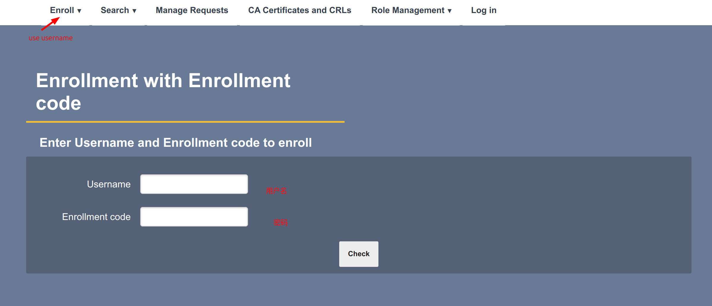
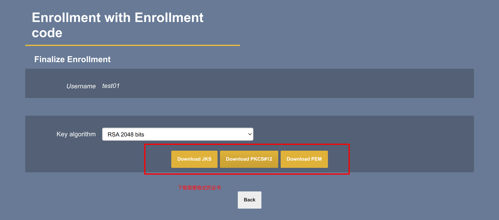
